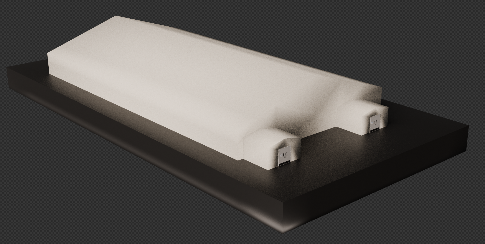

<!--  -->
Hi My name is Bryan A Quero
=====================================================================================================================================

XR, Video Game, Technical and Software Developer
-------------------------------------------------

* 🌍  I'm based in Winter Springs, Florida
* 🖥️ Kindly find my [Portfolio](#Portfolio) on the page below.
* 🕸  WIP new portfolio website [3D Portfolio Under Construction Link ](https://bryanquero.com/)
* ✉️  You can contact me at [bryanq2008@live.com](mailto:bryanq2008@live.com)
* 🧠  I'm learning Rust
* 📜  [Resume](https://github.com/user-attachments/files/23362895/102725_Bryan_Alec_Quero_3D_WEB_SoftDev.pdf) 

## BIO
---
An experienced MERN full-stack developer and Technical Artist with extensive experience developing Architectural Models, Environments, Video games, Virtual Reality, Augmented Reality, Mobile and Website Applications. I also have many years of experience in architectural, mechanical, and electrical (MEP) design and construction.

---

<!-- ## I am Bryan Alec Quero, Software Engineer and XR developer working in the Orlando, Florida area with a Bachelor’s Degree and 15+ years of professional experience in Game Development and Technical Artist. --> 

<!--  -->
<!-- 
<!-- 

 -->

<!--  -->
<!--  -->
### Skills

### Game Engines

	

### Socials

  

<b>My GitHub Stats</b>

<!-- <a>

	
  
  <a href="https://github.com/ossu/computer-science">

  </a>
   <a href="https://github.com/thedaviddias/Front-End-Checklist/graphs/contributors">
   
  </a>
  <a href="https://github.com/thedaviddias/Front-End-Checklist/">
    
  </a>
    <a href="https://creativecommons.org/publicdomain/zero/1.0/">
    
  </a> -->
<!-- 	 

 --> 

<!-- &nbsp;
 &nbsp;	
  &nbsp;
  &nbsp;
  &nbsp;
  &nbsp;
  &nbsp;
  &nbsp;
  &nbsp;
  &nbsp;
  &nbsp;
  &nbsp;
  &nbsp;
  &nbsp;
  &nbsp;
  &nbsp;
   -->
	

### Badges

	 
	<blockquote class="badgr-badge" style="font-family: Helvetica, Roboto, &quot;Segoe UI&quot;, Calibri, sans-serif;">
UCF Coding Boot Camp (Full-Stack Web Development)

<strong style="font-size: 12px; font-weight: bold; font-style: normal; font-stretch: normal; line-height: 1.67; letter-spacing: normal; text-align: left; color: #000;" </script></blockquote>

 

	

	 
    <a href="https://images.credly.com/size/120x120/images/e5c2fa3e-842c-4f48-ade9-267f355364e5/CS-_XRDEV.png">
    
    </a>
	
Circuit Stream Certified XR Developer - Unity

	
Skills

	

		<ul align = center class="cr-badges-badge-skills__skills">
			<a class="track-link" tabindex="0" href="/skills/augmented-reality">Augmented Reality</a>
			 
			<a class="track-link" tabindex="0" href="/skills/c">C#</a>
			 
			<a class="track-link" tabindex="0" href="/skills/programming">Programming</a><a class="track-link" tabindex="0" href="/skills/unity-engineer">Unity Engineer</a>
			 
			<a class="track-link" tabindex="0" href="/skills/unity-programming">Unity Programming</a>
			 
			<a class="track-link" tabindex="0" href="/skills/virtual-reality-vr">Virtual Reality (VR)</a>
			 
			<a class="track-link" tabindex="0" href="/skills/vr-developer">VR Developer</a>
			 
			<a class="track-link" tabindex="0" href="/skills/vr-interaction">VR Interaction</a></ul>
	

	
	

 
---
### Portfolio
---
--- 
## MERN Full Stack, XR, Game Developer Portfolio

<h2>Car Color Change Configuration APP (WIP) </h2>

https://github.com/Bryan3D/Bryan3D/assets/10051887/49b30eb6-f4fa-4e51-be49-1c01c8dff823

Description:

The Car Color Change Configuration App is an assertive and robust mobile application designed to empower car enthusiasts, owners, and automotive professionals to quickly and accurately customize the exterior color of their vehicles.
This innovative app is tailored for both Android and iOS platforms, providing a seamless and immersive experience to its users. With this cutting-edge app, users can confidently explore, visualize, 
and transform the aesthetics of their automobiles with ease and precision.

[Download the app here for demo ](https://drive.google.com/drive/folders/1CY2kZPybGOBnQQAnwD3VJy-lj8nz4UTV?usp=drive_link)
---

<h2>Figma Weather App Prototype</h2>

👉 [View Full Interactive Prototype](https://www.figma.com/proto/wNY13Rj7xHXzFpPlc8pvVZ/WeatherApp?node-id=1-53&p=f&t=rg9XcIOir8bDUDid-1&scaling=scale-down&content-scaling=fixed&page-id=0%3A1&starting-point-node-id=1%3A53)

---

	
 

👉[Georgia Evengreens Website](https://georgia-evergreens.herokuapp.com/)

---

<h2>Gun Of Glory Game Landing Page Prototype </h2>

Description:

In the lonely aftermath of a world torn asunder, where the echoes of civilization's collapse still reverberated, a new era dawned. The old world had crumbled, giving way to a wasteland where the rule of law was a distant memory, and the only currency that mattered was survival.
In this unforgiving landscape, where hope was a rare and precious commodity, a disparate group of survivors emerged. United by a shared desire to endure the unrelenting chaos, they banded together to form a resilient community known as "Guns of Glory." Their motto: "Adapt, Overcome, Survive."
The survivors faced a world in turmoil, where resources were scarce and dangers were abundant. The skies, once filled with the hum of progress, were now a canvas for storms and roving bands of marauders. The remnants of cities were crumbling fortresses, each a battleground for those who would do anything to live another day.
As the sun dipped below the horizon, the Guns of Glory survivors prepared for another night of vigilance. In the flickering light of campfires, they honed their skills, crafted weapons and fortifications, and shared tales of the world that had been lost. Each day brought new challenges, but it also brought opportunities for resilience, camaraderie, and, ultimately, survival.
In this post-apocalyptic world, the Guns of Glory community would face the unknown together, forging their path through the ruins of a broken world, ready to defend their hope and ensure that the legacy of humanity would not be extinguished. Survival of the fittest had become survival of those who dared to unite, adapt, and become the accurate Guns of Glory.

---

<h2>(WIP) Python| Flask SaaS Aplication. </h2>

Description:

Our Work-in-Progress (WIP) Python Flask SaaS website is an exciting project currently under development. It is set to revolutionize how businesses and individuals manage their data, collaborate, and streamline their operations. While this SaaS (Software as a Service) platform is still in the early stages of development, here's a glimpse of what to expect from our innovative solution:
Cloud-Based Efficiency: Our SaaS website is designed to harness the power of the cloud. It will enable users to access their data and tools from anywhere, fostering a new level of collaboration and productivity.
User-Centric Design: The user experience is at the forefront of our development efforts. We're working hard to create a clean, intuitive, and user-friendly interface that will breeze navigation and data management.
Customizable Dashboards: Our SaaS will allow users to create personalized dashboards. This empowers them to monitor critical metrics, access the tools they need, and stay informed at a glance.
Data Security: Security is a top priority. We're implementing robust encryption, authentication, and authorization mechanisms to keep your data confidential.
Scalability: As your business or organization grows, our SaaS will grow with you. We're building it to be scalable to accommodate your needs as they evolve.
Integration Capabilities: We understand the importance of seamless integration with other applications and services. Our SaaS will offer a range of APIs and integration options to enhance your workflow.
Real-time Collaboration: Collaboration is key in today's fast-paced world. Our SaaS will facilitate real-time collaboration, enabling teams to work together effortlessly, even when physically apart.
Data Analytics and Insights: Our SaaS will provide robust data analytics and reporting tools, helping you make data-driven decisions.
Subscription Model: The SaaS model means you only pay for what you use without the hassle of managing software updates and infrastructure. It's a cost-effective and convenient solution.
Ongoing Development: We're committed to continuous improvement. Even as a WIP project, our team actively gathers user feedback to fine-tune the features and functionality.
While this Python Flask SaaS website is still in progress, we're excited about its potential to help businesses and individuals optimize their data management, collaboration, and productivity. Stay tuned for updates, and join us toward a more efficient and connected future.

[click ➡](https://bryanq2008.pythonanywhere.com/)

<h2>(WIP) Python 📕 Booking appointment app created for barbershop clients. </h2>

 

Description:

This WIP application has been developed to cater to the unique needs of a barbershop client who has expressed dissatisfaction with the existing application. The current application was deemed inadequate by the client, necessitating a more effective and efficient solution to address their concerns. This application has been designed to meet the specific requirements of the barbershop, with a focus on improving its functionality and usability. The development team has carefully considered the client's feedback and concerns and has incorporated them into the application's design. The final product is a high-quality application expected to meet clients' expectations and satisfy their needs.

[click ➡](https://bryan3d-barberapapps-app-evishm.streamlit.app)
---

<h2>(WIP) Quotes generator </h2>

---

[GetQuotes](https://bryan3d.github.io/GetQuote/)

Description:

The GetQuotes website offers a vast collection of over 4,000 quotes for sharing on various social media platforms. This resource provides a convenient solution for those seeking to enhance their online presence through inspiring and thought-provoking quotes. With such a comprehensive selection, users can easily find and share quotes that align with their interests and values, ultimately fostering engagement and building a more robust online community.

---

[Woofr dogs social media](https://woofr2.herokuapp.com/)
---

---
[Work Day Scheduler Web Page App](https://bryan3d.github.io/Work-Day-Scheduler/)
---

---
[SocialNet](https://github.com/Bryan3D/Challenge18SocialNetworkApi)
--- 

-----
Game Developer And Technical Artist
-----

-Unreal Environment Design

---
Assets Creations
---

---

Four-Hour Modeling, Designs, and Render

---

	

	
---

Designs

---

---
Large Scale Building 

---

---
- Character Design and Animation 

---
- AR Geospatial Android Unity 

---
### AI Games Designed in Unity
- Toss the Dices Game

https://github.com/Bryan3D/Bryan3D/assets/10051887/03d6dde2-478e-4595-9834-80521c19b48a

- The Slot Machine Game

https://github.com/Bryan3D/Bryan3D/assets/10051887/1f756991-4121-4f03-b177-056f481b9cd9

---
- Harley-Davidson E-commerce Website 

- Disney Wish Cruise

--- 
 - Disney_Galaxy of Edge (BIM Managing Team)

--- 
- Character Design: Modeling, Texture, Rigging, and Blendshape

VR Thanos Gauntlet Prototype
---

https://user-images.githubusercontent.com/10051887/208159832-1d1ed328-271e-4649-9ecf-4c9aed0f4624.mp4

---
## For More Pieces of Work
[3D and VR Development Portfolio Drive](https://drive.google.com/drive/folders/1mtm5-vfWdFmaiwW9CcgxBBa2Oas8uvLe?usp=share_link) 🔗

<!--
**Bryan3D/Bryan3D** is a ✨ _special_ ✨ repository because its `README.md` (this file) appears on your GitHub profile.

Here are some ideas to get you started:

- 🔭 I’m currently working on ...
- 🌱 I’m currently learning ...
- 👯 I’m looking to collaborate on ...
- 🤔 I’m looking for help with ...
- 💬 Ask me about ...
- 📫 How to reach me: ...
- 😄 Pronouns: ...
- ⚡ Fun fact: ...
-->
